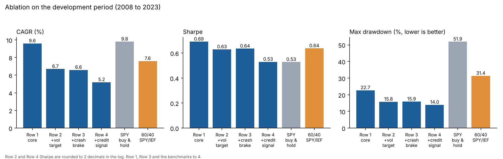
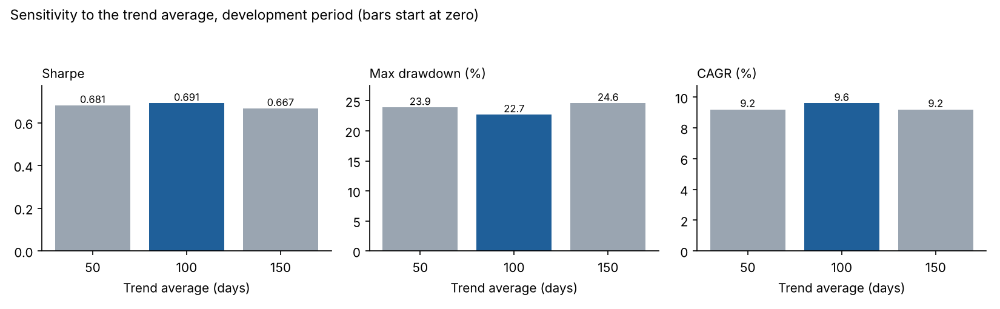
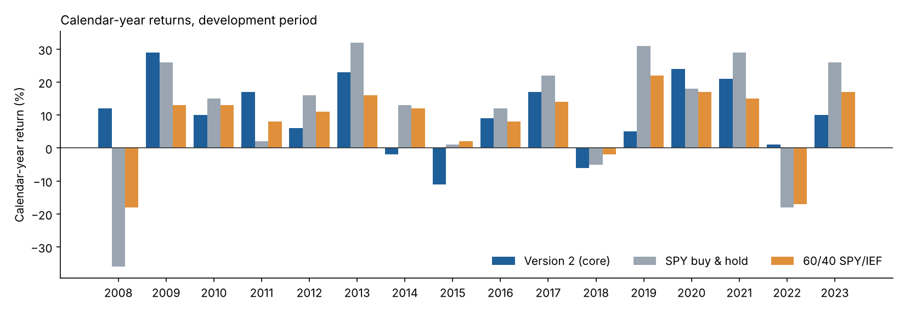
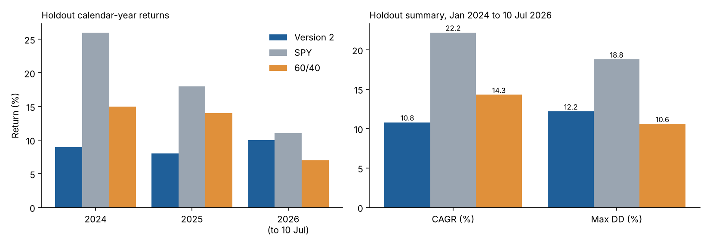
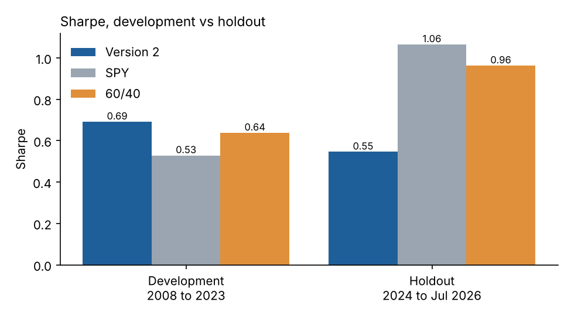
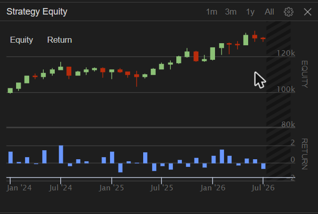

# ETF Rotation Backtest

A rule-based weekly ETF rotation strategy, backtested on QuantConnect (LEAN, Python).

This repo now holds **Version 2** (the main code, `main.py`). The first version is kept in the `v1/` folder so you can see what changed and why.

> This is a research project, not a validated live strategy. Version 2 did **not** beat a simple SPY or 60/40 portfolio on the holdout period. The results below are shown as they came out.

## The short version

- Version 2 rotates weekly between 12 ETFs, holds the top 3 that are trending up, and parks the rest in cash (BIL).
- I tested three optional risk switches (volatility target, crash brake, credit signal). I wrote the selection rule **before** seeing results. The rule picked the simplest version: **all three switches off**.
- Development period (2008 to 2023): 9.6% a year with a max drawdown of 22.7%, against SPY at 9.8% a year with a 51.9% drawdown.
- Holdout, run once (Jan 2024 to 10 Jul 2026): 10.8% a year, Sharpe 0.55. SPY did 22.2% (Sharpe 1.06) and a 60/40 SPY/IEF portfolio did 14.3% (Sharpe 0.96). **Version 2 lost to both.**

## Rules (Version 2)

- **Universe (12):** SPY, QQQ, IWM, EFA, EEM, XLF, XLE, VNQ, TLT, IEF, GLD, DBC. Cash is BIL. HYG is only used as a signal and is never held.
- **When:** rebalance on the first trading session of each week. The decision uses the close and the order is a market order at the next open.
- **Score:** `(0.4 x 21 day return + 0.4 x 63 day return + 0.2 x 126 day return) / annualized 20 day volatility`.
- **Eligible:** price is above its 100 day average and the score is above zero.
- **Holdings:** the top 3 eligible ETFs. An existing holding is kept while it stays eligible and in the top 5. Empty slots go to BIL.
- **Weights:** inverse 20 day volatility, max 40% per ETF, the excess is redistributed, the remainder goes to BIL.
- **Trading:** skip weight changes under 2%. Full exits always execute.
- **Costs:** Interactive Brokers fee model plus 2 basis points of slippage per side.
- **Optional switches** (`True`/`False` at the top of `main.py`, all off by default):
  - `USE_VOL_TARGET`: scale total exposure to `min(1, 10% / estimated portfolio volatility)`.
  - `USE_CRASH_BRAKE`: cap exposure at 50% if SPY closes more than 5% below its 20 day high.
  - `USE_CREDIT_SIGNAL`: cap exposure at 50% if the HYG/IEF ratio is below its 50 day average.
  - If several caps apply, the lowest one is used.

## How the test was set up

- **Development period:** Jan 2008 to Dec 2023. All design choices were made here.
- **Holdout period:** Jan 2024 to 10 Jul 2026 (the last day of data available to me). It was run **once**, with the final settings, and nothing was changed afterwards.
- `RUN` at the top of `main.py` selects `"dev"`, `"oos"` or `"full"`.
- The algorithm prints its own results table to the QuantConnect Logs tab. It compares the strategy with SPY buy and hold and with a 60/40 SPY/IEF portfolio rebalanced monthly (both simulated with the same 2 bps cost).
- Sharpe uses BIL returns as the risk-free rate. "Turnover" is gross buys plus sells, divided by average equity, per year, with no halving.

## Results

### Ablation on the development period (2008 to 2023)

| | CAGR | Vol | Sharpe | Max drawdown | Worst year | Longest underwater | Turnover/yr | Trades |
|---|---|---|---|---|---|---|---|---|
| **Row 1: core only (chosen)** | 9.6% | 13.5% | 0.6912 | -22.7% | -10.9% (2015) | 1,009 days | 1,624% | 1,345 |
| Row 2: + vol target | 6.7% | 10.0% | 0.63 | -15.8% | -10.0% (2015) | 1,009 days | 1,863% | 2,374 |
| Row 3: + crash brake | 6.6% | 9.7% | 0.6353 | -15.9% | -10.6% (2015) | 950 days | 2,241% | 2,667 |
| Row 4: + credit signal | 5.2% | 8.7% | 0.53 | -14.0% | -7.5% (2015) | 1,287 days | 2,834% | 2,917 |
| SPY buy and hold | 9.8% | 20.1% | 0.5283 | -51.9% | -36.2% (2008) | 1,210 days | 6% | 1 |
| 60/40 SPY/IEF | 7.6% | 11.2% | 0.6377 | -31.4% | -17.5% (2008) | 854 days | 32% | 384 |

Rows 2 and 4 show Sharpe to two decimals because that is what I read from the log before I changed the printout to four decimals.

The switches did what they say: they cut the drawdown (from -22.7% to between -14.0% and -15.9%). But they also cut the return by roughly a third or more, and none of them improved Sharpe. Turnover went up with each one.

### How the final version was picked

The rule, written before I saw any results: *pick the simplest row whose Sharpe is within 0.05 of the best row, and among those the one with the lowest max drawdown.*

- Best Sharpe: Row 1 at 0.6912.
- Row 3 was the close call. Its Sharpe is 0.6353, which is 0.0559 below Row 1. That is just outside the 0.05 line, so it is out. (On the rounded numbers it looked like exactly 0.05, so I re-ran it with four decimals to settle it.)
- Rows 2 and 4 are further away. Only Row 1 is left, so it wins.

The honest reading: the extra risk rules did not earn their place in the development period.

### Sensitivity of the trend average (development period, core only)

| Trend average | CAGR | Vol | Sharpe | Max drawdown | Worst year | Longest underwater | Turnover/yr | Trades |
|---|---|---|---|---|---|---|---|---|
| 50 days | 9.2% | 13.1% | 0.6813 | -23.9% | -12.6% (2015) | 770 days | 2,084% | 1,508 |
| **100 days (chosen)** | 9.6% | 13.5% | 0.6912 | -22.7% | -10.9% (2015) | 1,009 days | 1,624% | 1,345 |
| 150 days | 9.2% | 13.4% | 0.6671 | -24.6% | -10.6% (2015) | 1,107 days | 1,569% | 1,331 |

The results do not swing much: Sharpe stays between 0.67 and 0.69. There is no sharp peak at 100 days. The time underwater moves more (770 to 1,107 days), but that is driven by a few specific dips. The vol target and crash brake are off in the chosen version, so there was nothing to vary for them.

The 50 day run had two orders rejected for insufficient buying power (2012-08-14 and 2013-06-24), so that row is slightly less clean than the others. See Limitations.

### Calendar-year returns (development period)

### Holdout (Jan 2024 to 10 Jul 2026), run once

| | CAGR | Vol | Sharpe | Max drawdown | Longest underwater | Turnover/yr | Trades |
|---|---|---|---|---|---|---|---|
| **Version 2** | 10.8% | 12.2% | 0.5459 | -12.2% | 393 days | 1,565% | 242 |
| SPY buy and hold | 22.2% | 15.9% | 1.0648 | -18.8% | 127 days | 40% | 1 |
| 60/40 SPY/IEF | 14.3% | 9.9% | 0.9625 | -10.6% | 186 days | 58% | 62 |

Version 2 ended at $129,398.52 from $100,000 (+29.4%), with $422.76 in fees (QuantConnect figures).

Calendar-year returns: Version 2 had +9% in 2024, +8% in 2025 and +10% in 2026 so far. SPY had +26%, +18% and +11%. The 60/40 had +15%, +14% and +7%.

Screenshot of the QuantConnect equity chart for the holdout run:

**What I take from this:** the strategy was steady and had a smaller drawdown than SPY, but it gave up a lot of return in a strong stock market and lost to a plain 60/40 on return per unit of risk. Sharpe also dropped from 0.69 in development to 0.55 in the holdout. Over 2.5 years, one run cannot say much either way, but it gives no evidence that this strategy adds value over simple alternatives.

## Limitations

- **One short holdout.** 2.5 years, run once. It is a single path, not proof of anything.
- **Turnover is very high** (about 1,600% a year in the core version) and I have not worked out why. The dollar fees are small in this test ($6,680 over 16 years on $100,000), but the number looks too high for a weekly three-holding rotation and may point to a sizing quirk.
- **Rejected orders.** The 50 day sensitivity run had two orders rejected for insufficient buying power. I believe it is a leverage and order-sizing issue around full exits and re-entries. I did not see it in the 100 day, 150 day, ablation or holdout logs, but I have not fixed it.
- **Benchmarks are my own simulation.** SPY buy and hold and the 60/40 are simulated inside the algorithm with the same 2 bps cost, not taken from a QuantConnect benchmark.
- **Rounding.** Two ablation rows show Sharpe to two decimals only (see above).
- **Data and platform.** Free-tier QuantConnect data, ending 10 Jul 2026. Results are read from the algorithm's own log table. I did not export the raw equity curve.
- **No like-for-like comparison with Version 1.** Version 1 ran from March 2010 and used other rules. Its numbers (below) are for reference only.
- **Not investment advice.** Past results do not predict future results.

## What I got wrong in Version 1

I am keeping Version 1 in `v1/` instead of deleting it, so the mistakes are visible.

1. **No real out-of-sample test.** Version 1 reported one backtest over the whole period (March 2010 to July 2026) that I had looked at while building the rules. Those numbers are likely flattering. Version 2 fixes this with a development period and a holdout period that I only ran once.
2. **It did not beat SPY.** Version 1 ended at about $376,259 (8.43% a year, 17.6% max drawdown, Sharpe 0.458 on QuantConnect's calculation) while SPY buy and hold ended near $913,748. I should have led with that instead of with the drawdown.
3. **I did not test whether each rule helped.** Version 1 stacked several rules on top of each other. Version 2 tests each risk switch on its own (an ablation) and drops the ones that do not help.
4. **A bug.** Version 1's own limitations list one invalid BIL order. Version 2 is a rewrite, but it has its own order problem (see Limitations), so I am not claiming the order logic is fixed.
5. **No rule for choosing the final version.** In Version 2 the selection rule was written down before the results.

Version 2 is still not a winner. It is a cleaner, more honest test.

## Files

- `main.py`: Version 2 algorithm (paste into a QuantConnect project).
- `ETF-Rotation-Version2-Report.pdf`: short write-up with the same tables and charts.
- `charts/`: the charts used above.
- `v1/`: Version 1 code, README and report.
